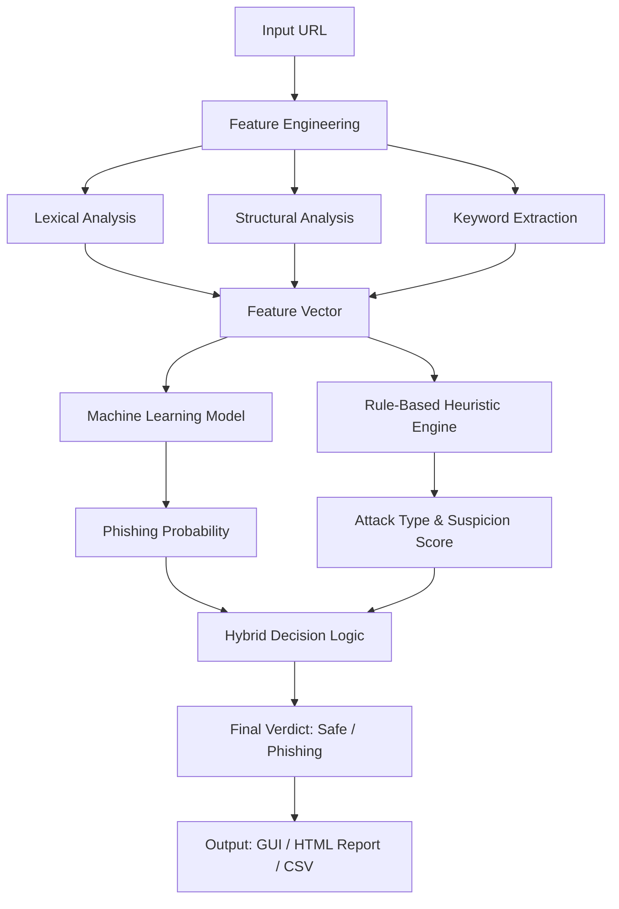

# Phishing Website Detection System using Hybrid Machine Learning

[](https://www.python.org/)
[](LICENSE)
[](https://scikit-learn.org/)
[](#)

## Project Abstract

This project implements an end-to-end cybersecurity solution for identifying malicious URLs. It utilizes a hybrid approach that integrates supervised Machine Learning classifiers with a heuristic rule-based engine. By analyzing lexical and structural features of a URL, the system predicts the probability of phishing and categorizes the specific attack vector, such as credential theft or malware distribution. The solution includes a complete data pipeline, a graphical user interface (GUI) for real-time analysis, and a batch processing tool for large-scale reporting.

## System Architecture



## Core Features

*   Hybrid Decision Logic: Combines Machine Learning (Random Forest/XGBoost) with a rule-based engine to minimize false negatives.
*   Attack Type Classification: Heuristically identifies attack vectors including Credential Phishing, Financial Theft, Account Verification, Prize Scams, and Malware Attacks.
*   Real-Time Analysis: A Tkinter-based GUI for individual URL verification with detailed decision factors.
*   Automated Batch Reporting: Processes multiple URLs from CSV or TXT files, generating comprehensive HTML dashboards and statistical charts.
*   Extensive Feature Engineering: Extracts 20+ features including domain length, subdirectory depth, IP-based hosting detection, and sensitive keyword flags.

## Machine Learning Pipeline

### 1. Data Processing
The system utilizes curated datasets from sources such as PhishTank, UCI, and Kaggle. Data is cleaned and labeled (0 for Legitimate, 1 for Phishing) before being merged into a master training set.

### 2. Feature Engineering
The engine extracts three categories of features:
*   Structural: URL length, domain length, number of dots, hyphens, and subdirectories.
*   Abnormalities: Presence of the '@' symbol, IP addresses in the hostname, and absence of HTTPS.
*   Keywords: Detection of high-risk strings such as 'login', 'verify', 'update', and 'bank' in the URL path or query.

### 3. Training and Evaluation
The pipeline supports multiple tree-based models (Random Forest, XGBoost) and Logistic Regression. Models are evaluated using:
*   Accuracy, Precision, Recall, and F1-Score.
*   Confusion Matrix analysis.
*   K-fold cross-validation across different train-test splits (60/40, 70/30, 80/20).

## Hybrid Engine Logic

The final verdict is reached through a weighted combination of ML output and heuristic scores:
*   ML Prediction: Provides a probability score between 0 and 1.
*   Rule-Based Score: Adds suspicion points for red flags (e.g., HTTP with sensitive keywords, brand impersonation patterns).
*   Override Logic: If the rule-based engine identifies a high-confidence attack pattern, it can override a borderline ML prediction to ensure maximum security.

## Project Structure

```text
phishing_detection/
├── data/                    # Raw and processed datasets
├── models/                  # Serialized .pkl models and scalers
├── results/                 # Batch results, CSVs, and HTML reports
├── step1_environment.py     # Environment setup and abstract
├── step2_engineering.py     # Feature extraction logic
├── step3_merge.py           # Dataset integration
├── step4_training.py        # Model training and rule definition
├── step5_gui.py             # Tkinter GUI implementation
├── batch_report.py          # Batch analysis and HTML generation
├── requirements.txt         # Dependency specifications
└── README.md                # Technical documentation
```

## Technical Implementation

### Requirements
*   Python 3.8+
*   Pandas, Numpy (Data Manipulation)
*   Scikit-Learn (Machine Learning)
*   Matplotlib, Seaborn (Visualizations)
*   Tkinter (GUI)

### Execution Flow
1. Data Preparation: Execute steps 1 through 3 to process raw data and engineer features.
2. Model Training: Execute step 4 to generate the `main_phishing_model.pkl` and `scaler.pkl`.
3. Deployment: 
    *   Run `step5_integrate_predict_gui.py` for the interactive interface.
    *   Run `batch_analysis_project_report.py` for automated analysis of URL lists.

## Ethical Statement

This software is developed for defensive cybersecurity research and educational purposes. It is designed to empower users and organizations to identify malicious infrastructure. The developers emphasize the responsible use of this tool and do not condone its application for unauthorized activities.


*   Development Team: WASIK-S (Lead Developer), Salma S (Architect/Contributor)

***
